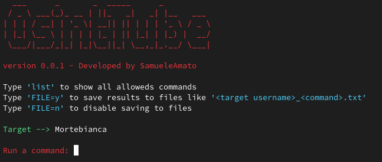

# OsintTube 🔍


   
 <h6>
    <a href="redkatz.github.io/osinttube">OsintTube</a> is an <i>Easy-to-Use</i> YouTube <i>OSINT</i> Tool</a>
</h6>

</p><p align="center">
  
</p>
<br>

Disclaimer: **FOR EDUCATIONAL PURPOSES ONLY! The contributors bear no responsibility for the tool's usage.**

### Tool and Commands 💻

---

OsintTube offers an interactive shell to perform analysis on Youtube account of any users by its id. You can get:

```text
- description   :Get the channel description
- location      :Get the channel location
- vidnumber     :Get the total number of channel videos
- subnumber     :Get the number of subscribers 
- views         :Get the total number of channel views
- earnings      :Get the estimated value of the channel's earnings in one month
- target <id>   :Set a new target
```
[**Latest version**]() | [Website]()

### Installation ⚙️

---

- Clone this repo
  - `git clone https://github.com/RedKatz/OsintTube`
- Navigate to the directory
  - `cd OsintTube`
- Install the requirements
  - `pip3 install requirements.txt`
- Run the program
  - `python3 main.py <id>`

### Get the user id

1. open the youtube channel of the targert
2. go to the _information_ section
3. click on the arrow at the bottom and click on copy id


---
